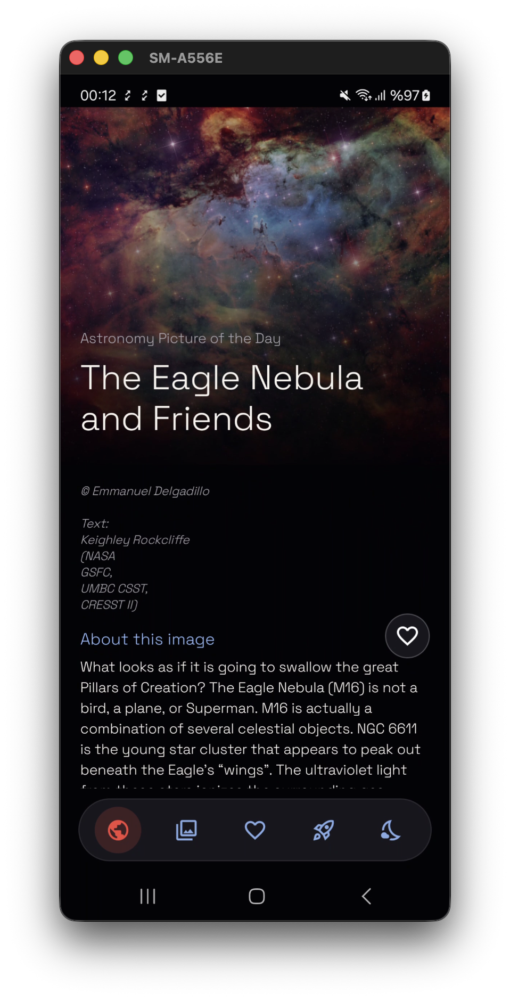
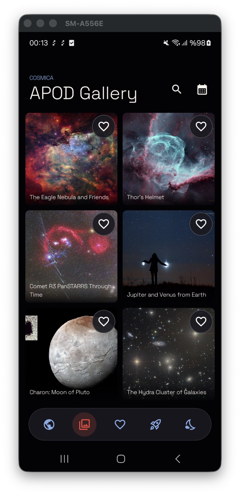
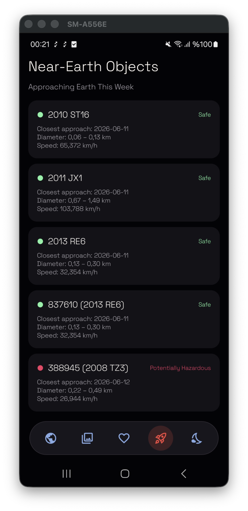
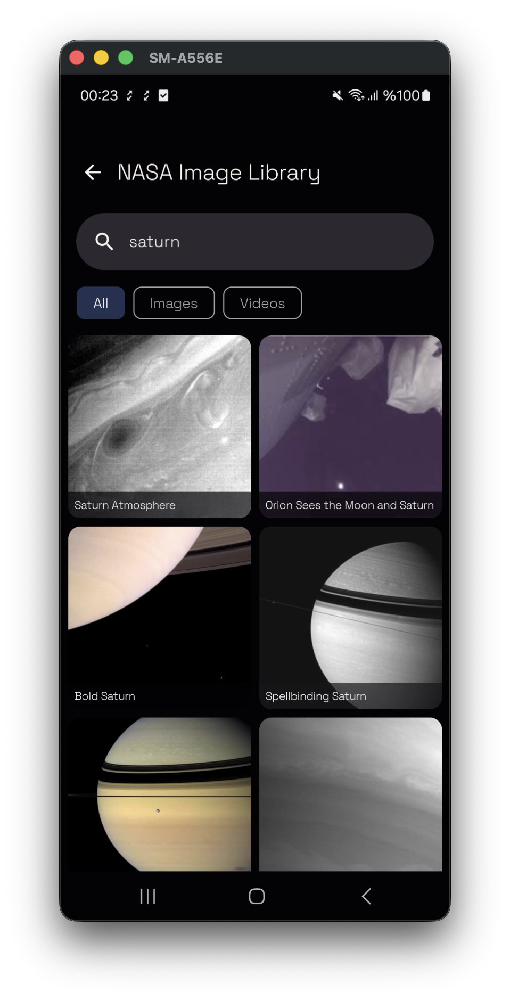
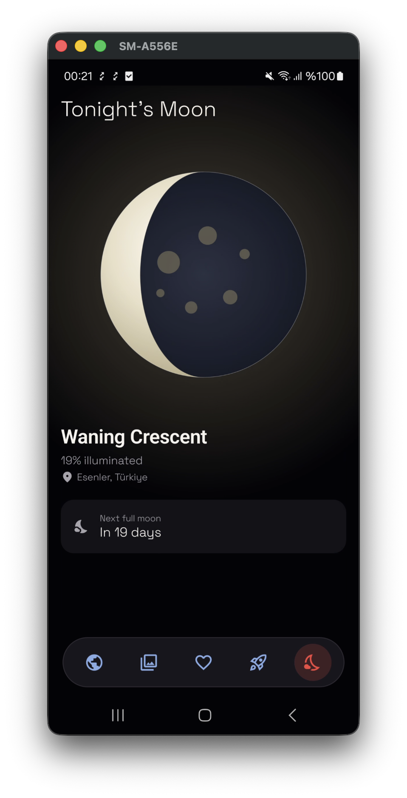
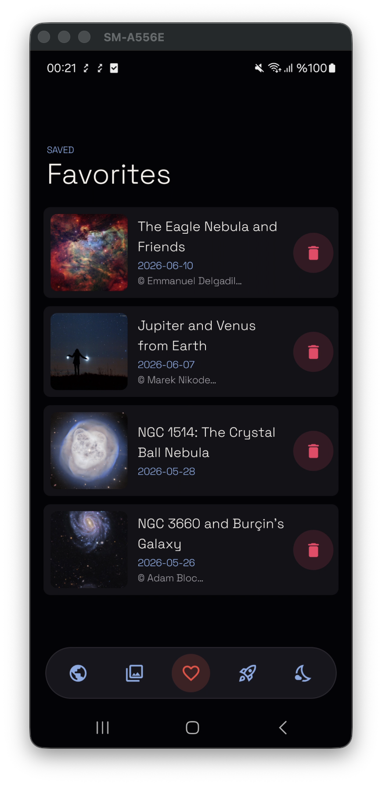
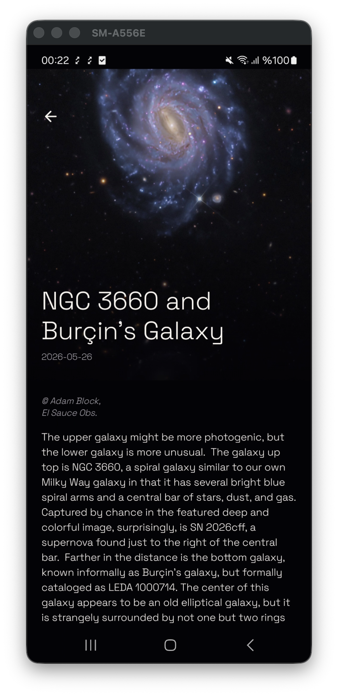

# Cosmica 🚀

> A modern Android app for exploring space, built entirely with **Jetpack Compose** and powered by NASA's public APIs.

Cosmica lets users discover up-to-date, visual content about space. All data is fetched from **NASA's free, public APIs** — the app has no backend of its own. It was built from scratch to demonstrate end-to-end Android development with Jetpack Compose, from the UI layer down to the data layer.

| | |
|---|---|
| **Package** | `com.cosmica.app` |
| **Min SDK** | 26 (Android 8.0) |
| **Target / Compile SDK** | 36 |
| **Language** | Kotlin |
| **UI** | 100% Jetpack Compose (no XML layouts) |
| **Architecture** | Clean Architecture + MVVM |
| **Data source** | NASA Open APIs (APOD, NeoWs, NASA Image Library) |

> 🇹🇷 Türkçe proje dokümanı için: [docs/PROJE_DOKUMANI.md](docs/PROJE_DOKUMANI.md)

---

## 1. Features

### 🌌 Home
Highlights NASA's **Astronomy Picture of the Day (APOD)**. Content can be an image or a video; video content is supported via **ExoPlayer (Media3)** and **YouTube** playback.

### 🖼️ Gallery
Browse past APOD entries by date range in a smooth, **Paging 3**-backed list. Each item has a detail screen and can be added to favorites.

### ☄️ Asteroids
Lists near-Earth objects passing by this week via the NASA **NeoWs** API. The detail screen shows diameter, close-approach distance, velocity and hazard status.

### 🔍 Search
Keyword image search against the **NASA Image Library**, with a detail screen for each result.

### 🌙 Moon Phase
Uses the device **location** (Google Play Services Location) to compute the current moon phase and renders a custom visualization with **Compose Canvas**.

### ⭐ Favorites
Favorited content is stored locally with **Room** and available offline. Add/remove is handled through an animated favorite button.

### ✨ UX Details
- Fully **dark, space-themed** UI (`CosmicaTheme`)
- **Shimmer** loading effects, custom empty and error states
- **Bottom navigation** between screens (Navigation Compose)

---

## 2. Screenshots

> 📸 Screenshots not added yet. Drop the images into `docs/screenshots/` using the file names below and this table will render automatically.

| Home | Gallery | Asteroids |
|:---:|:---:|:---:|
|  |  |  |

| Search | Moon Phase | Favorites |
|:---:|:---:|:---:|
|  |  |  |

| Detail Screens |
|:---:|
|  |

---

## 3. Architecture

The app follows **Clean Architecture** principles, split into three layers. This keeps the layers independent, the business logic testable, and maintenance simple.

```
┌─────────────────────────────────────────────┐
│  PRESENTATION (Jetpack Compose + MVVM)        │
│  Screens · ViewModels · UI State              │
└───────────────────────┬───────────────────────┘
                        │ (UseCase calls)
┌───────────────────────▼───────────────────────┐
│  DOMAIN (pure Kotlin, framework-independent)   │
│  Models · UseCases · Repository interfaces     │
└───────────────────────┬───────────────────────┘
                        │ (interface implementations)
┌───────────────────────▼───────────────────────┐
│  DATA                                          │
│  Remote (Retrofit/API) · Local (Room) ·        │
│  Mapper · Paging · Calculator                  │
└─────────────────────────────────────────────┘
```

**Layer responsibilities:**

- **Presentation** — Each screen has a `Composable` and a `ViewModel`. ViewModels expose `StateFlow`-based UI state following a unidirectional data flow (UDF); the UI never calls APIs directly.
- **Domain** — Framework-independent business rules. `UseCase`s do exactly one thing (e.g. `GetTodayApodUseCase`, `GetAsteroidsThisWeekUseCase`, `AddFavoriteUseCase`). Repositories are defined here as **interfaces**.
- **Data** — Concrete implementations of the repository interfaces: networking (`Retrofit` + API services), local persistence (`Room` DAO/Entity), DTO→Domain conversions (`Mapper`) and pagination (`Paging`).

**Dependency management:** All dependencies are injected with **Hilt** (`di/` modules), which makes ViewModels and repositories easy to test.

---

## 4. Tech Stack

| Area | Technology |
|------|-----------|
| **UI** | Jetpack Compose, Material 3, Compose Navigation, Material Icons Extended |
| **Architecture** | Clean Architecture, MVVM, UseCase pattern |
| **DI** | Hilt (Dagger) |
| **Async** | Kotlin Coroutines & Flow |
| **Networking** | Retrofit 2 + Gson, OkHttp Logging Interceptor |
| **Image loading** | Coil 3 |
| **Local database** | Room |
| **Pagination** | Paging 3 (+ Paging Compose) |
| **Media** | Media3 ExoPlayer + YouTube player |
| **Location** | Google Play Services Location |
| **Logging** | Timber |
| **Testing** | JUnit, MockK, Turbine, Coroutines Test |

**Key versions:** Kotlin 2.1.0 · AGP 8.7.3 · Compose BOM 2024.12.01 · Hilt 2.52 · Retrofit 2.11.0 · Coil 3.0.4 · Room 2.6.1 · Paging 3.3.5 · Media3 1.5.1

---

## 5. Project Structure

```
com.cosmica.app
├── di/                 # Hilt modules (network, database, repository bindings)
├── domain/
│   ├── model/          # Apod, NearEarthObject, NasaImage, MoonPhase, Coordinates
│   ├── repository/     # Repository interfaces
│   └── usecase/        # 13 single-responsibility use cases
├── data/
│   ├── remote/
│   │   ├── api/        # ApodApiService, NeoApiService, NasaImageApiService
│   │   ├── dto/        # API response models
│   │   └── interceptor/# API key / logging interceptors
│   ├── local/
│   │   ├── dao/        # Room DAOs
│   │   └── entity/     # Room entities
│   ├── mapper/         # DTO → Domain conversions
│   ├── paging/         # Paging 3 PagingSources
│   ├── calculator/     # Moon phase calculation logic
│   └── repository/     # Repository implementations
└── presentation/
    ├── home/           # Home + YouTube/video player
    ├── gallery/        # APOD gallery + detail
    ├── asteroids/      # Asteroid list + detail
    ├── search/         # NASA image search + detail
    ├── moonphase/      # Moon phase (Canvas drawing)
    ├── favorites/      # Favorites
    ├── navigation/     # NavGraph, routes, bottom nav
    ├── common/         # Reusable components (shimmer, empty/error state…)
    └── theme/          # Color, typography, theme
```

---

## 6. Build Flavors & API Key Management

The NASA API key is never hard-coded into the source — it's managed safely:

- **`dev`** flavor → uses NASA's `DEMO_KEY` (for development).
- **`prod`** flavor → uses the real `NASA_API_KEY`.

The real key lives in `local.properties` (which is **not** committed to version control) and is injected into the app at build time via `BuildConfig`.

---

## 7. Testing

Business logic and the presentation layer are covered by unit tests:

- **MockK** to mock dependencies,
- **Turbine** to assert `Flow`/`StateFlow` emissions,
- **kotlinx-coroutines-test** to drive coroutines on a controlled dispatcher.

Covered components include `MoonPhaseCalculator`, `NeoMapper`, the use cases, and the `Home`, `Asteroids`, `Favorites` and `MoonPhase` ViewModels.

---

## 8. CI/CD

The project runs an automated pipeline on GitHub Actions (`.github/workflows/ci.yml`):

```
lint → unit_tests → build_debug → (on main) build_release
```

It also ships **Fastlane** lanes for local/remote automation: `test`, `lint`, `build_debug`, `build_release`, `deploy_test`.

---

## 9. Getting Started

```bash
# 1. Clone the project
git clone <repo-url>

# 2. Add your NASA API key to local.properties (for prod)
NASA_API_KEY=your_key_here   # free at https://api.nasa.gov

# 3. Open in Android Studio and run the dev flavor
#    (dev uses DEMO_KEY, so it runs without a key)
```

---

## 10. Jetpack Compose Highlights

This project demonstrates end-to-end app development with Jetpack Compose:

- ✅ **100% Compose UI** — every screen, no XML layouts
- ✅ **State management** — `StateFlow` + `collectAsStateWithLifecycle`, unidirectional data flow (UDF)
- ✅ **Compose Navigation** — type-safe routes and bottom navigation
- ✅ **Custom drawing** — the moon phase rendered with `Canvas`
- ✅ **Animation** — favorite button and shimmer loading effects
- ✅ **Paging 3 + Compose** integration for endless lists
- ✅ **Coil 3** for asynchronous image loading
- ✅ **Media3/ExoPlayer** video playback embedded in Compose
- ✅ **Hilt** ViewModel injection in Compose
- ✅ Material 3 design system with a custom dark theme
